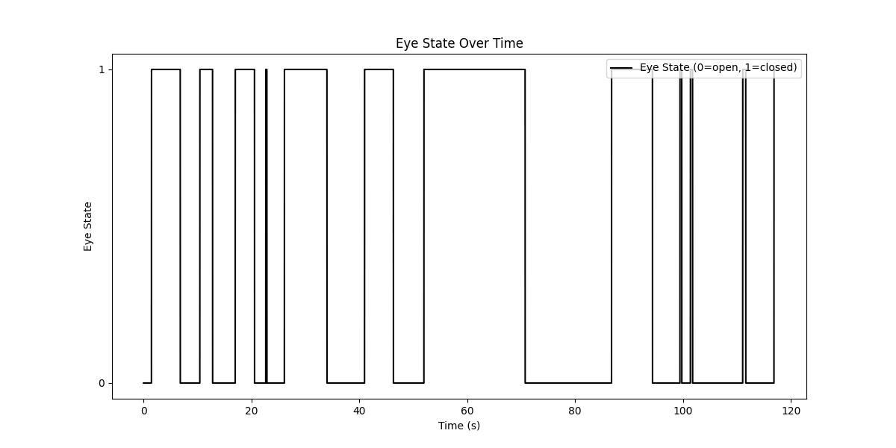
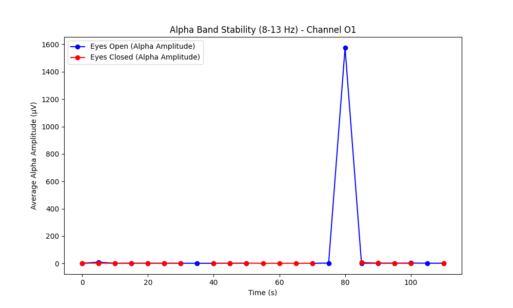
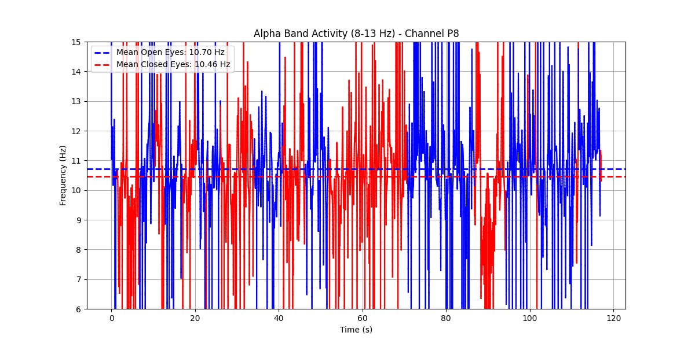

# EEG Eye State Analysis Demo

This project is designed for educational purposes to learn and experiment with EEG data processing and analysis techniques. It demonstrates how to load, filter, and visualize EEG data along with associated eye state information.

**Please note:**  
The raw EEG data used in this project has not been cleaned of artifacts. As a result, the analysis results may be influenced by noise or unwanted signals present in the data.

## Data Attribution

The EEG Eye State dataset used in this project is licensed under a [Creative Commons Attribution 4.0 International (CC BY 4.0)](https://creativecommons.org/licenses/by/4.0/) license.

The dataset was obtained from the [UCI Machine Learning Repository](https://archive.ics.uci.edu/dataset/264/eeg+eye+state).

Appropriate credit is given to the original authors and source.

## Requirements

The project relies on the following Python packages:

- numpy
- pandas
- matplotlib
- scipy

Install the dependencies using pip:

```bash
pip install -r requirements.txt
```

## Usage

To run the analysis, execute the main script:

```bash
python main.py
```

When run, the script will:

- Load EEG data from the ARFF file
- Calculate the sampling rate based on the measurement duration
- Plot the eye state over time
- Analyze and plot the alpha band stability and activity for specified EEG channels (default channels are O1, O2, P7, and P8)

## Visualizations

Below are some sample screenshots generated by the code.

**Eye State Over Time**  
This figure shows the eye state over time, illustrating periods when the eyes are open (0) or closed (1):  


**Alpha Band Stability**  
This plot displays the stability of the alpha band amplitude, which may provide clues regarding potential artifacts in the data:  


**Alpha Band Activity**  
Theoretically, when the eyes are closed, the alpha frequency should decrease. In this figure, you can observe that the mean alpha frequency for closed eyes is lower than for open eyes:  

